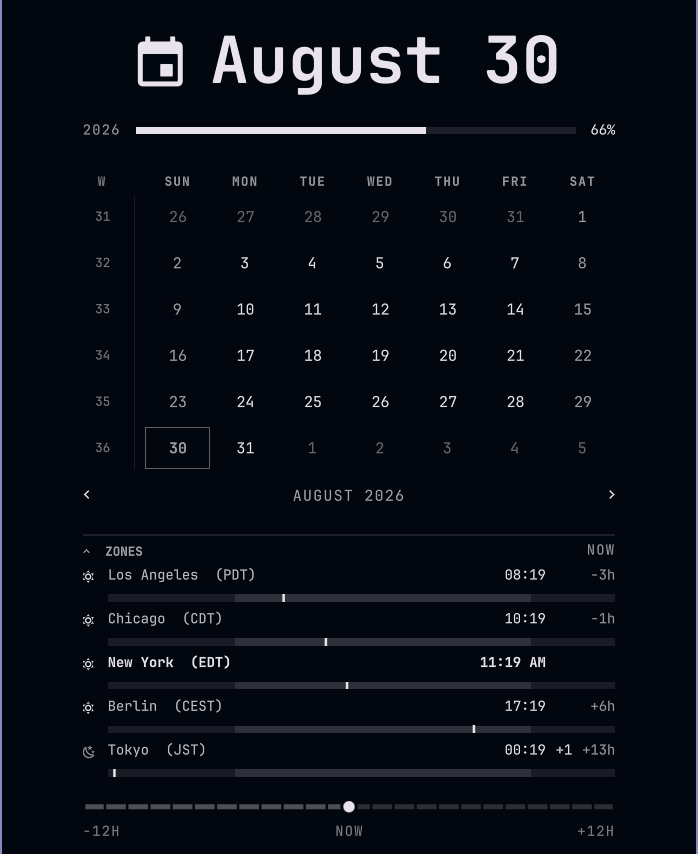

# Clock, Zones & Calendar

An Omarchy bar widget: the clock, with a **time-zone converter** and optional
**read-only calendar sync** folded into the calendar popup. Installs as
`angelv.clock` — the plugin id is unchanged, only the repository was renamed.

Based on Omarchy's built-in `omarchy.clock` widget — see
[Attribution](#attribution).

<p align="center">
  
</p>

## What it does differently

- **A zones section under the calendar**, collapsed by default. Each row gets a
  sun/moon glyph, a 24-hour day/night rail, and a magnetic scrubber, so a time
  quoted in someone else's zone lands in yours at a glance.
- **The home row is detected from `timedatectl`**, so it is always this
  machine's real zone. You never list it yourself.
- **Memento mori can be switched off.** Set `"mementoMori": false` and the life
  bar and its double-tap gesture are gone. On by default, as upstream.
- **Calendar sync, read-only and off by default.** Point it at Google's or
  Apple's iCal link and the month grid gets event dots, with an agenda for the
  day you click and optional reminders before a meeting. See
  [Calendar sync](#calendar-sync).

Everything themes with Omarchy: there is no hardcoded colour in the plugin, every
value goes through `Color.*`, `Style.*`, or `bar.foreground`.

## Install

```bash
omarchy plugin add https://github.com/angel-ventura/omarchy-clock-zones-calendar.git --enable
```

Pick `center` when it asks for a section. Then remove the stock clock, since
you now have two:

```bash
omarchy plugin disable omarchy.clock
omarchy restart shell
```

## Remove

```bash
omarchy plugin remove angelv.clock
omarchy restart shell
```

Removal moves the folder to a hidden timestamped backup beside it rather than
deleting it, and puts Omarchy's own `omarchy.clock` back in the bar in its
place. To keep it installed but switch it off instead:

```bash
omarchy plugin disable angelv.clock
```

## Requirements

Omarchy 4 (`omarchy-shell`). **Nothing to install** — every command this uses
already ships with Omarchy:

| Command | Used for |
| --- | --- |
| `date`, `timedatectl` | Zone offsets, and detecting your home zone |
| `python3` | Fetching and parsing calendar feeds. Standard library only — no pip packages |
| `notify-send`, `xdg-open` | Reminders, and opening a meeting or calendar link |

`python3` is guaranteed: Omarchy depends on `uwsm`, which depends on Python.

Calendar sync is the only part that touches the network, and only to GET the
feed URLs you configure.

## Configure

**Click the gear in the top right of the popup.** It opens a settings window
covering everything below — calendar feeds, zones, and the clock's own options
— so none of it needs a text editor.

It is a real window rather than a panel inside the popup: the popup is capped
to the width of the month grid, which is nowhere to put a searchable zone
picker or a pasted iCal URL. Every control writes as you change it; the popup
picks the change up the next time you open it.

Feed URLs are masked, with a **Show** button per row. A Google iCal address is
a bearer credential — anyone holding it can read that calendar indefinitely,
without signing in — so it should not be sitting in plain text on a screen you
might share or screenshot.

Escape closes it, and so does your close-window key — it is a real window, not
an overlay drawn on top of your desktop, so the window manager treats it like
any other application. That is the reason it is a window: an overlay would
have your close-window key hit whatever is *behind* it instead, which is a
habit worth not teaching.

Being a real window, Hyprland tiles it by default. To have it float, put this
in `~/.config/hypr/hyprland.lua`:

```lua
o.window(
  { class = "org\\.quickshell", title = "Clock, Zones & Calendar.*" },
  { float = true, size = "900 760", center = true }
)
```

The title is matched as well as the class because every Quickshell window
shares `org.quickshell`. Patterns are full-match, hence the trailing `.*`.

The files below are still the source of truth, and hand-editing them works
exactly as it always did.

The zones are configuration, not code. Edit this widget's entry in
`~/.config/omarchy/shell.json`:

```json
{
  "id": "angelv.clock",
  "format": "dddd h:mm AP",
  "formatAlt": "d MMMM 'W'ww yyyy",
  "verticalFormat": "h\n—\nmm\nAP",
  "homeName": "Atlanta",
  "homeHour12": true,
  "zones": [
    "America/Los_Angeles",
    "Europe/London",
    "Asia/Tokyo"
  ]
}
```

| Key | What it does |
| --- | --- |
| `format` / `formatAlt` | The bar label, and what it shows when clicked through |
| `verticalFormat` | The label when the bar is on a vertical edge |
| `homeName` | The **label** for the home row only — the zone itself is detected |
| `homeHour12` | 12-hour clock for the home row |
| `zones` | IANA zone names to show as extra rows |
| `mementoMori` | `false` removes the life bar and its gesture. On by default |
| `calendarSync` | Rarely needed — sync follows whether a feed is configured. Set `false` to stay inert next to a `calendars.json` another tool owns |
| `syncIntervalMinutes` | Minutes between background pulls. `0` is manual only. Default 15, floor 5 |
| `notifyUpcomingEvents` | `false` silences reminders. On by default when sync is on |
| `notifyMinutesBefore` | `"staged"` (10m, 5m, 1m) or a single number of minutes |
| `hour12` | Agenda times as 12-hour with AM/PM, or 24-hour. Unset follows your locale |
| `meetingHandler` | `"webapp"` (default) opens Zoom and Meet in their own window; `"browser"` always uses xdg-open |

Notes:

- **Never put your home zone in `zones`** — it is added automatically.
- Rows sort by UTC offset, west to east, whatever order you write them in.
- Changes apply the **next time you open the panel**, not while it is open.

## Calendar sync

Off until you ask for it. Once on, the popup grows a dot under every day that
has something on it and an agenda for the day you click; days are only clickable
once sync is on, so the grid stays the plain read-out it was designed as when it
is off.

### Setting it up

Create `~/.config/omarchy/calendars.json` with your calendar link in it:

```json
[
  {
    "name": "Personal",
    "url": "paste your link here",
    "color": "#4A90E2",
    "enabled": true
  }
]
```

Then `omarchy restart shell`. That is the whole setup — sync switches itself on
once a feed is configured, and stays off while none is. Later edits to the file
are picked up immediately, with no restart.

**Where the link comes from:**

| | |
| --- | --- |
| **Google** | *Settings and sharing* → *Integrate calendar* → **Secret address in iCal format**. Shown as dots — use the copy button |
| **Apple iCloud** | Share icon → turn on **Public Calendar** → copy the `webcal://` link. This genuinely publishes the calendar; iCloud has no private option |
| **Outlook / 365** | *Settings → Calendar → Shared calendars → Publish a calendar*. Often disabled by company admins |
| **Anything else** | Any `.ics` or `webcal://` link — Proton, Nextcloud, Fastmail, or a local file path |

Treat these links like passwords: anyone holding one can read that calendar.
The file is created readable only by you.

### The feed list

Feeds live in `~/.config/omarchy/calendars.json`, **not** in `shell.json` — a
private iCal URL is a bearer credential in disguise, and `shell.json` is the file
people paste into forum posts. The file is written `0600` and re-read whenever it
changes, so no restart is needed after an edit.

```json
[
  {
    "name": "Personal",
    "url": "https://calendar.google.com/calendar/ical/you%40gmail.com/private-xxxxxxxx/basic.ics",
    "color": "#4A90E2",
    "enabled": true
  },
  {
    "name": "Family",
    "url": "webcal://p00-caldav.icloud.com/published/2/xxxxxxxx",
    "color": "#e5c07b",
    "enabled": true
  }
]
```

Add as many as you like — each gets its own colour, a filter chip in the agenda
header, and can be switched off with `"enabled": false` without deleting it.

This is deliberately **read-only**: both of those are one-way feeds, so events
cannot be created or edited from the panel. Two things follow from that, and
neither is a bug in this plugin:

- Google caches its own iCal feed, so an edit made on the web can take a while
  to show up here. A sync interval under five minutes buys nothing, which is
  why five is the floor.
- Apple's link requires the calendar to be *published*, which means anyone who
  has the URL can read it. Treat it accordingly.

If you need writable calendars, OAuth against a restricted Google calendar, or
JMAP/Fastmail, use [sync-calendar-omarchy](https://github.com/promaaa/sync-calendar-omarchy),
which this borrows its iCalendar reader from and which does all of that. Note
that it is also a clock widget, so the two replace each other rather than
stacking — run one or the other.

| In the panel | |
| --- | --- |
| Click a day | Show that day's agenda |
| Click the big date at the top | Back to today: the current month, and the agenda back on today. Live only when there is something to undo |
| Calendar chips | Filter by calendar |
| Refresh button | Sync now. Its tooltip shows when it last synced |
| Plus button | Start a new event on the shown day in Google Calendar. Only appears if a Google feed is configured |
| Click an event | Open it in Google Calendar, where you can edit or delete it |
| Camera button on an event | Join a detected Meet / Zoom / Teams / Webex / Jitsi link. The tooltip names the host it will open |

The buttons sit in the agenda header and on each event row; hover any of them
for a tooltip. (They are drawn with Nerd Font icons, which is why they are
described in words here rather than shown.)

Clicking an event is read-only on this side: it opens Google Calendar and
leaves the editing to Google, so the widget still stores no credential and
still never writes to a calendar. A Google feed carries no link back to its
events, so the link is built from the event id in the feed and the calendar
address in the feed URL; where an id is not one Google issued, the click falls
back to that day's view. Feeds that are not Google's have no address to build
from, and their rows are not clickable.

The plus button opens Google's own new-event form with the day filled in, as
an all-day event you can give a time in the form. It lands in whichever
calendar is the default for the account you are signed in as — a feed can be
one you only subscribe to, so the button does not try to aim at the calendar
the agenda came from. Nothing is created until you save it there.

**Sign in to Google in Chromium first.** By default the event opens as an
Omarchy web app, and those run in Chromium — a separate browser profile from
your daily one, signed out until you sign in there once. See
[Where a click lands](#where-a-click-lands).

### Reminders

A desktop notification before a meeting starts, whether or not the popup is
open. `"staged"` (the default) nudges at 10, 5 and 1 minutes; a number fires
once at that mark. All-day events never notify, and each nudge fires once —
never twice for the same event and stage.

Set `"notifyUpcomingEvents": false` to silence them.

### Where a click lands

By default (`"meetingHandler": "webapp"`) a call opens in its own window rather
than a browser tab. Camera and microphone permission is per-origin and sticks,
and a real window can carry a Hyprland rule — a browser tab cannot. Clicking an
event to open it in Google Calendar follows the same setting.

| Click | Opens |
| --- | --- |
| Zoom | `zoommtg://`, which Omarchy's own handler turns into the web client. A natively installed Zoom claims that scheme first, which is better still |
| Google Meet | Its own window, via `omarchy-launch-webapp` |
| An event, or the plus button | Google Calendar in its own window, same way |
| Teams, Webex, Jitsi, anything else | Your default browser |

**You do not need to install a web app for any of this.**
`omarchy-launch-webapp` is `chromium --app=<url>` and takes the address
directly, so Meet and Google Calendar get their own window whether or not an
entry exists. Creating one only adds it to the launcher with a name and an
icon, which is worth doing for the ones you open by hand:

**Super + Alt + Space → Install → Web App**, then a name and an address — say
`Google Calendar` and `https://calendar.google.com/`. It will ask for an icon;
any image URL or an installed icon name works.

What these windows *do* need is a signed-in Chromium: it is a separate browser
profile, so sign in to Google there once. Set `"meetingHandler": "browser"` to
send everything to your default browser instead.

## Hacking on it

Zone offsets are read by shelling out to `date`. Qt's JS engine accepts the
`timeZone` option on `Intl`/`toLocaleString` and then silently ignores it, so
IANA zones cannot be resolved in QML directly.

After editing `Panel.qml`, reload with `omarchy restart shell` — a
`rescanPlugins` is not enough for panel changes.

If you are developing against this rather than using it, prefer
`omarchy plugin disable angelv.clock` over `omarchy plugin remove` — remove
moves your working copy to a hidden `.bak` folder and restores the stock clock.

## Attribution

This work is **based on Omarchy**. It began as a byte-for-byte clone of the
Omarchy shell's first-party clock widget, made with `omarchy plugin clone
omarchy.clock`, and `BarWidget.qml`, `Model.js` and `Panel.qml` still contain
substantial portions of that original code.

- Upstream: [basecamp/omarchy](https://github.com/basecamp/omarchy)
- Upstream author: David Heinemeier Hansson / Basecamp
- Upstream license: MIT

The calendar sync is **derived from
[sync-calendar-omarchy](https://github.com/promaaa/sync-calendar-omarchy)** by
promaaa, also MIT. `fetch-events.py` keeps that project's iCalendar reader and
its RRULE expanders; the Google API, OAuth, JMAP and event-writing paths were
removed, since none of them are needed for a read-only .ics feed.

- Upstream: [promaaa/sync-calendar-omarchy](https://github.com/promaaa/sync-calendar-omarchy)
- Upstream author: promaaa
- Upstream license: MIT

Unofficial and independent — not endorsed by or affiliated with the Omarchy
project or Basecamp. See [NOTICE](NOTICE) for the full derivation record.

## License

MIT, retaining the upstream copyright notice. See [LICENSE](LICENSE).
